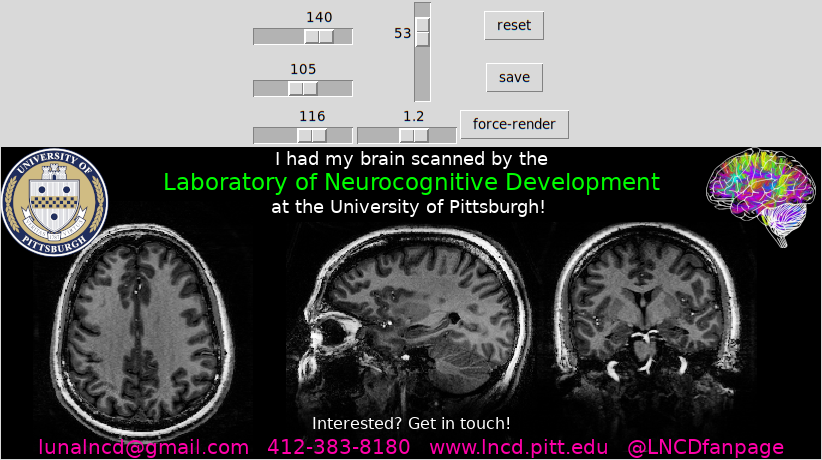

# Brain Image Share
A python3 library/script to create a sharable jpeg out of a nifti image with a contact template overlay.



## Install and run

```
# install
pip3 install http://github.com/LabNeuroCogDevel/BrainImageShare
# run
python3 -m brainimageshare
# OR if ~/.local/bin is in $PATH
brainimageshare 
```

## Modifying contact template

`gimp` layered image `overlay.xcf` is exported to `brainimageshare/templates/overlay.png`.

To change or add images
 - clone the code
 - modify and save overlay.png
 - (re)install the module

```
git clone http://github.com/LabNeuroCogDevel/BrainImageShare
cd BrainImageShare.py
gimp overlay.xcf # save to brainimageshare/templates/overlay.png
pip3 install -e .
```
